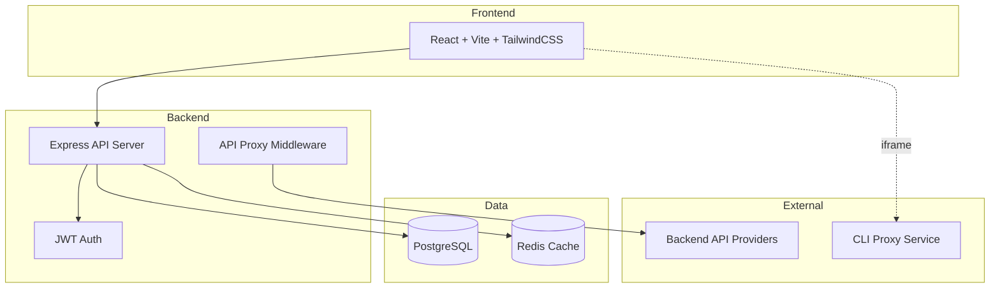
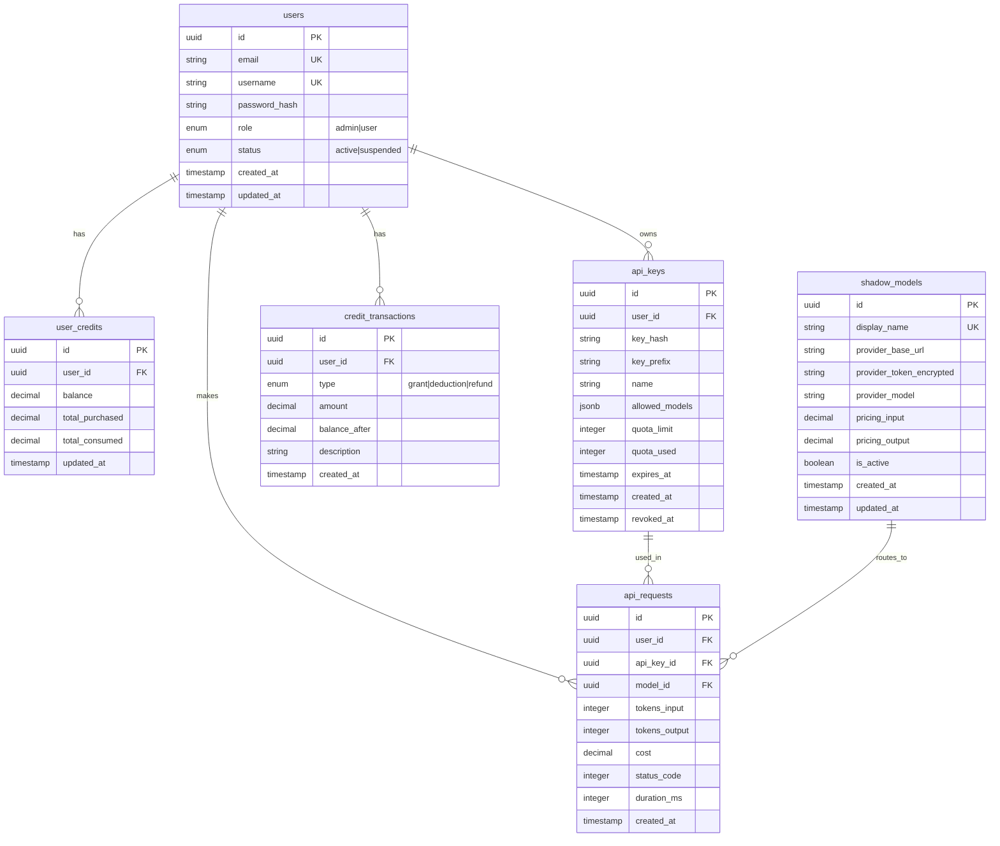
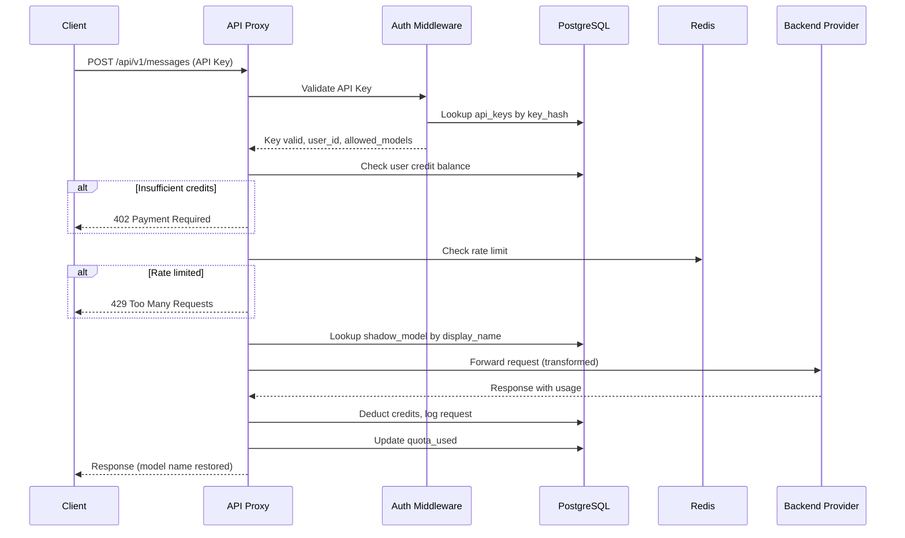
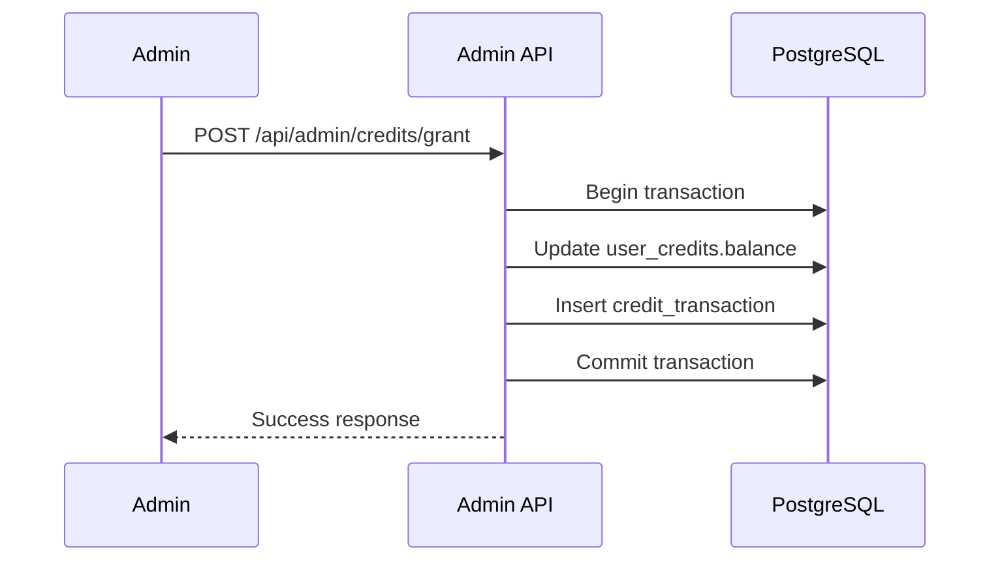

# API Marketplace Platform - Technical Design

## Architecture Overview

A monolithic Node.js application with React frontend, PostgreSQL database, and Redis cache. The system acts as an API proxy that routes requests through admin-configured shadow models while handling authentication, billing, and analytics.



## Tech Stack

| Layer | Technology | Purpose |
|-------|------------|---------|
| Backend | Node.js + Express + TypeScript | API server and proxy |
| Frontend | React + Vite + TailwindCSS | User interface (white theme) |
| Database | PostgreSQL + Prisma ORM | Persistent data storage |
| Cache | Redis | Sessions, rate limiting, caching |
| Auth | JWT + bcrypt | Authentication and API key hashing |
| Container | Docker + Docker Compose | Deployment and orchestration |

## Database Schema



## API Endpoints

### Authentication
| Method | Endpoint | Description | Auth |
|--------|----------|-------------|------|
| POST | `/api/auth/register` | User registration | Public |
| POST | `/api/auth/login` | User login | Public |
| POST | `/api/auth/logout` | User logout | JWT |

### User
| Method | Endpoint | Description | Auth |
|--------|----------|-------------|------|
| GET | `/api/users/me` | Get current user profile | JWT |
| GET | `/api/users/me/credits` | Get credit balance and history | JWT |
| GET | `/api/users/me/usage` | Get usage statistics | JWT |

### API Keys
| Method | Endpoint | Description | Auth |
|--------|----------|-------------|------|
| GET | `/api/api-keys` | List user's API keys | JWT |
| POST | `/api/api-keys` | Create new API key | JWT |
| DELETE | `/api/api-keys/:id` | Revoke API key | JWT |

### Admin
| Method | Endpoint | Description | Auth |
|--------|----------|-------------|------|
| GET | `/api/admin/users` | List all users | Admin |
| GET | `/api/admin/users/:id` | Get user details | Admin |
| POST | `/api/admin/credits/grant` | Grant credits to user | Admin |
| GET | `/api/admin/models` | List shadow models | Admin |
| POST | `/api/admin/models` | Create shadow model | Admin |
| PUT | `/api/admin/models/:id` | Update shadow model | Admin |
| DELETE | `/api/admin/models/:id` | Delete shadow model | Admin |
| GET | `/api/admin/stats` | Platform statistics | Admin |

### Proxy Endpoints
| Method | Endpoint | Description | Auth |
|--------|----------|-------------|------|
| POST | `/api/v1/messages` | Anthropic-compatible | API Key |
| POST | `/api/v1/chat/completions` | OpenAI-compatible | API Key |

## Frontend Routes

| Route | Component | Access | Description |
|-------|-----------|--------|-------------|
| `/` | LandingPage | Public | Landing page |
| `/login` | LoginPage | Public | User login |
| `/register` | RegisterPage | Public | User registration |
| `/dashboard` | Dashboard | User | User dashboard |
| `/api-keys` | ApiKeysPage | User | API key management |
| `/usage` | UsagePage | User | Usage statistics |
| `/admin` | AdminDashboard | Admin | Admin dashboard |
| `/admin/users` | AdminUsersPage | Admin | User management |
| `/admin/models` | AdminModelsPage | Admin | Shadow model config |
| `/cliproxy/control-panel` | CliProxyPage | Admin | CLI Proxy iframe |

## Key Flows

### API Request Flow



### Credit Grant Flow



## Components

| Component | Responsibility | Location |
|-----------|---------------|----------|
| AuthMiddleware | JWT validation, role checking | `src/middleware/auth.ts` |
| ApiKeyMiddleware | API key validation for proxy | `src/middleware/apiKey.ts` |
| ProxyController | Request transformation and routing | `src/controllers/proxy.ts` |
| CreditService | Balance management, deductions | `src/services/credit.ts` |
| ModelService | Shadow model CRUD operations | `src/services/model.ts` |
| UsageService | Analytics and statistics | `src/services/usage.ts` |

## Error Handling

| Error Case | HTTP Status | Response |
|------------|-------------|----------|
| Invalid credentials | 401 | `{ error: "Invalid credentials" }` |
| Invalid/revoked API key | 401 | `{ error: "Invalid API key" }` |
| Insufficient permissions | 403 | `{ error: "Access denied" }` |
| Model not allowed | 403 | `{ error: "Model not in allowed list" }` |
| Insufficient credits | 402 | `{ error: "Insufficient credits" }` |
| Rate limit exceeded | 429 | `{ error: "Rate limit exceeded" }` |
| Model not found | 404 | `{ error: "Model not found" }` |
| Provider error | 502 | `{ error: "Provider error", details: ... }` |

## Security Considerations

- Passwords hashed with bcrypt (cost factor 12)
- API keys hashed with SHA-256, only prefix stored in plain text
- Provider tokens encrypted with AES-256 before storage
- JWT tokens expire after 24 hours
- Rate limiting per API key and per IP
- CORS configured for frontend origin only
- Input validation on all endpoints
- SQL injection prevention via Prisma ORM

## Project Structure

```
├── docker-compose.yml
├── Dockerfile
├── package.json
├── prisma/
│   └── schema.prisma
├── src/
│   ├── index.ts
│   ├── config/
│   ├── controllers/
│   ├── middleware/
│   ├── routes/
│   ├── services/
│   └── utils/
├── frontend/
│   ├── package.json
│   ├── vite.config.ts
│   ├── tailwind.config.js
│   ├── index.html
│   └── src/
│       ├── main.tsx
│       ├── App.tsx
│       ├── components/
│       ├── pages/
│       ├── hooks/
│       └── services/
└── database/
    └── migrations/
```

## Test Strategy

- **Unit Tests**: Services, utilities, transformations
- **Integration Tests**: API endpoints, database operations
- **E2E Tests**: Critical user flows (login, API key creation, proxy requests)

